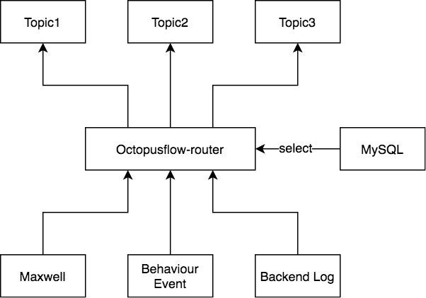
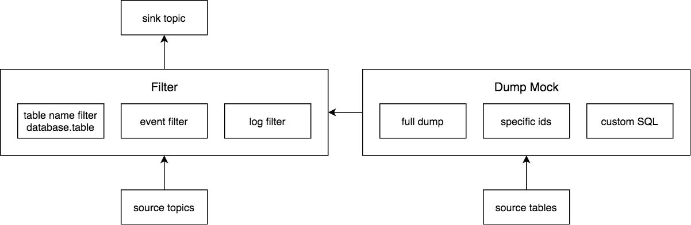
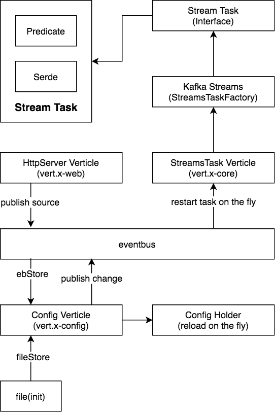

# octopusflow-router [![CI][1]][1] [![codecov][3]][4]

[1]: https://github.com/octopusflow/octopusflow-router/workflows/CI/badge.svg
[2]: https://goreportcard.com/badge/github.com/billryan/collections
[3]: https://codecov.io/gh/octopusflow/octopusflow-router/branch/master/graph/badge.svg "Coverage badge"
[4]: https://codecov.io/gh/octopusflow/octopusflow-router "Codecov Status"

## Architecture

octopusflow-router works like a filter and router for events, MySQL dump mock is not finished yet.

In octopusflow-router, `vert.x-config`, `vert.x-web`, `vert.x-core` and eventbus is heavily used.

